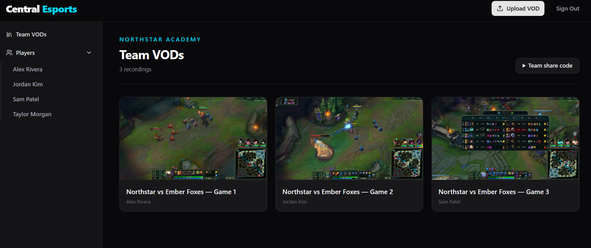
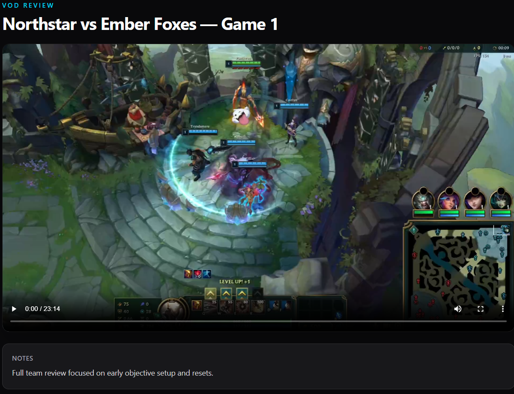
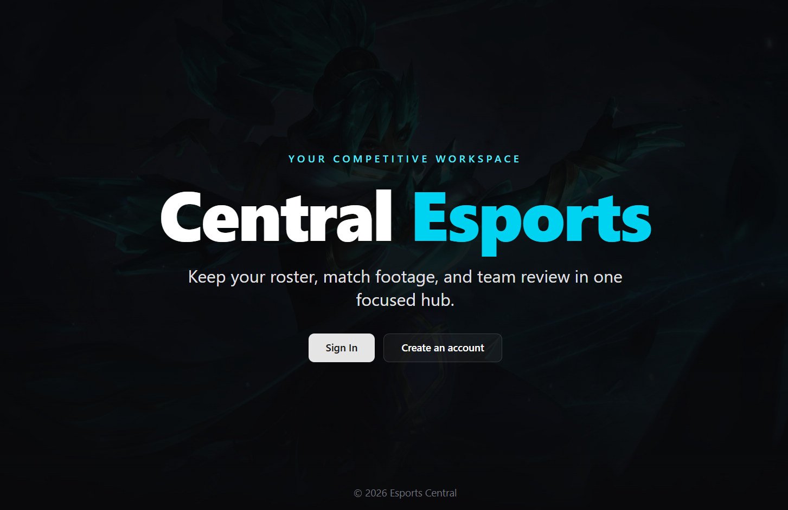
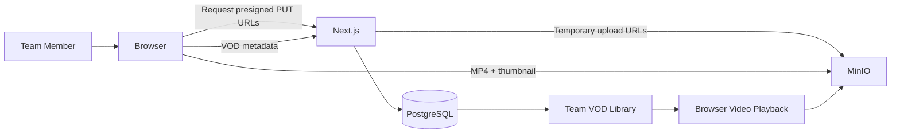

# Esports Central

**A self-hosted esports VOD library I built so my team could review scrim recordings outside the esports lab.**

**Status:** Completed personal project · No longer in active development

---

## Why I Built It

Our League of Legends scrims were automatically recorded on computers in the esports lab, but the recordings stayed on whichever machine captured them.

That meant players and coaches could not easily review those games from somewhere else.

I built **Esports Central** to give our team one shared place to upload, organize, and watch scrim VODs remotely.

The application was used by **6 players and 1 coach**.

---

## Product Walkthrough

### Team VOD Library

After signing in, team members can browse uploaded recordings from a shared dashboard, see generated thumbnails, and filter the library by player/uploader.

  

### VOD Review

Selecting a recording opens a dedicated review page with browser-based video playback and the VOD's notes/description.

  

### Landing Experience

Esports Central includes account creation and sign-in so players can access their team's workspace remotely.

  

---

## How Uploads Work

The most important technical part of Esports Central is the large-file upload path.

Instead of sending an MP4 through the Next.js application server:

1. An authenticated user selects an MP4 and enters its metadata.
2. The browser extracts a frame from the video and creates a JPEG thumbnail locally.
3. The browser requests temporary presigned upload URLs from the Next.js backend.
4. The MP4 and thumbnail upload **directly from the browser to MinIO**.
5. The browser displays upload progress for the video.
6. After the objects are uploaded, the application stores the VOD metadata, team ID, uploader ID, and object keys in PostgreSQL.
7. The recording then appears in the team's VOD library.

This design keeps large video transfers out of the Next.js process while the application server remains responsible for authentication and metadata.

---

## What I Built

I built Esports Central independently, including:

- User registration and authentication
- Team creation and joining
- Shared team VOD library
- Direct browser-to-MinIO uploads with presigned URLs
- Client-side thumbnail generation
- MP4 upload progress tracking
- PostgreSQL VOD metadata persistence with Prisma
- Player/uploader filtering
- Browser-based video playback
- Dockerized application infrastructure
- Self-hosted deployment

---

## Deployment

I hosted Esports Central on an **Ubuntu virtual machine** running under **Proxmox** on a rented server.

The application stack used Docker Compose for:

- Next.js
- PostgreSQL
- MinIO

I configured **NGINX** as the reverse proxy and served the application over **HTTPS** from my own `greyswag.dev` subdomain.

---

## Tech Stack

**Application:** Next.js · React · Node.js  
**Database:** PostgreSQL · Prisma  
**Authentication:** NextAuth · bcrypt  
**Object Storage:** MinIO · AWS S3 SDK  
**UI:** Tailwind CSS · Radix UI · Lucide  
**Infrastructure:** Docker · Docker Compose · Ubuntu · Proxmox · NGINX · HTTPS  
**Media:** HTML5 video · browser-generated JPEG thumbnails

---

## Project Status

Esports Central is **complete and no longer in active development**.

It was built in November 2025 to solve a specific problem for my esports team: making lab-recorded scrim VODs accessible outside the computers that captured them.

If I rebuilt it today, I would add stronger private object access, resumable uploads, upload reconciliation, stricter team authorization, automated tests, and service health monitoring.
I would also like to one day merge esports central and GTracker to be one suite for esports teams to use. 

---

## Source Code

The working source repository remains private.

The public project page does not expose:

- Storage or database credentials
- Authentication secrets
- Real team data
- Real team VODs
- Environment variables
- Private server details
- Deployment secrets

---

## About Me

**Greyson Denison-Fischer**  
Computer Science student at Central Michigan University  
Graduating May 2027

[LinkedIn](https://www.linkedin.com/in/greyson-fischer/) · [GitHub](https://github.com/dgreyson3)
